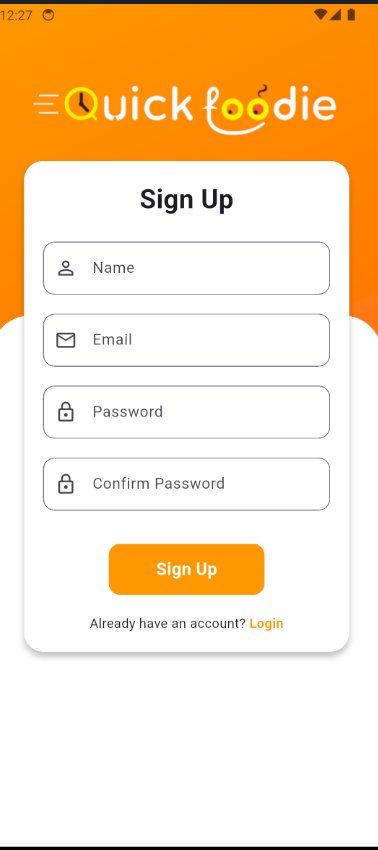
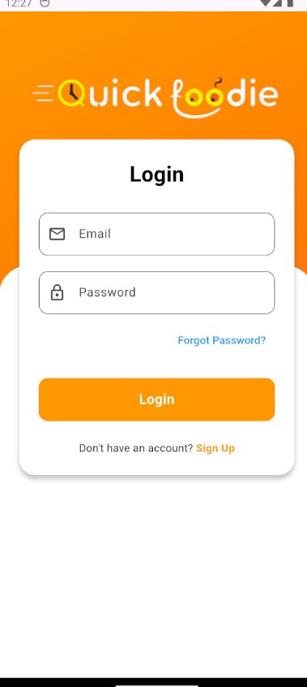
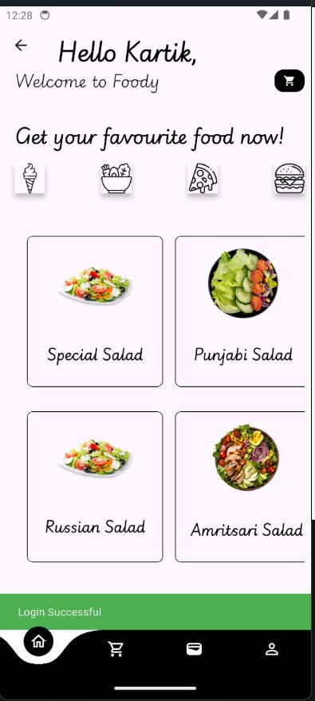
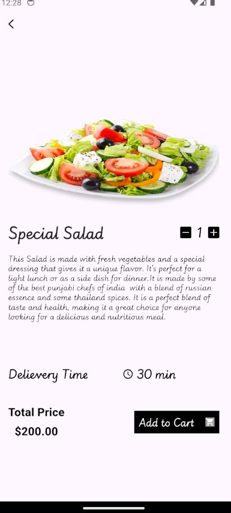
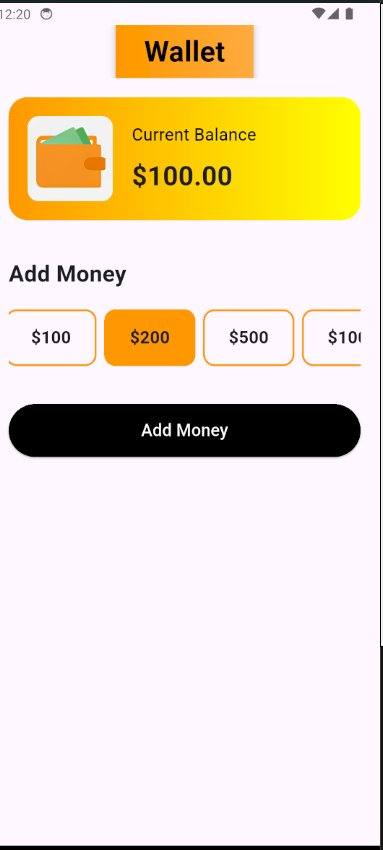

# 🍔 QuickFoodie

A modern food delivery mobile application built with a clean, intuitive UI. QuickFoodie lets users browse food categories, view item details, manage their cart, and handle wallet payments — all from a seamless mobile experience.

---

## 📱 Screenshots

| Sign Up | Login | Home |
|--------|-------|------|
|  |  |  |

| Item Detail | Wallet |
|-------------|--------|
|  |  |

---

## ✨ Features

- **Wallet & Payments (Stripe)**
  - Top up wallet with preset amounts ($100, $200, $500, $1000)
  - Secure payment processing via **Stripe**
  - Real-time balance update after successful payment
  - Payment intent creation handled server-side via Firebase Cloud Functions

- **Authentication (Firebase)**
  - User Sign Up with name, email, and password
  - User Login with email and password
  - "Forgot Password" support
  - Navigation between Login and Sign Up screens

- **Home Screen**
  - Personalized greeting (e.g., *Hello Kartik, Welcome to Foody*)
  - Browse food by category (Ice Cream, Salad, Pizza, Burger, etc.)
  - Grid view of food items with images and names
  - Cart icon in the top-right corner
  - Login success toast notification

- **Food Item Detail Screen**
  - Large food image
  - Item name and description
  - Quantity selector (increment / decrement)
  - Delivery time display
  - Total price calculation
  - Add to Cart button

- **Wallet Screen**
  - Display current balance
  - Quick-add money options: $100, $200, $500, $1000
  - Add Money button to top up wallet

---

## 🛠️ Tech Stack

| Layer | Technology |
|-------|-----------|
| Framework | Flutter / React Native |
| Language | Dart / JavaScript |
| State Management | Provider / Redux / GetX |
| Backend | **Firebase** |
| Auth | **Firebase Authentication** |
| Database | **Cloud Firestore** |
| Storage | **Firebase Storage** |
| Payments | **Stripe** |

---

## 🚀 Getting Started

### Prerequisites

- Flutter SDK / Node.js installed
- Android Studio or VS Code
- An Android/iOS device or emulator
- A Firebase project set up at [console.firebase.google.com](https://console.firebase.google.com)
- A Stripe account with API keys at [dashboard.stripe.com](https://dashboard.stripe.com)

### Installation

```bash
# Clone the repository
git clone https://github.com/your-username/quickfoodie.git

# Navigate to the project directory
cd quickfoodie

# Install dependencies
flutter pub get        # For Flutter
# OR
npm install            # For React Native

# Add your Firebase config
# Place google-services.json in android/app/ (Android)
# Place GoogleService-Info.plist in ios/Runner/ (iOS)

# Add your Stripe keys in .env or config file
STRIPE_PUBLISHABLE_KEY=pk_test_xxxxxxxxxxxx
STRIPE_SECRET_KEY=sk_test_xxxxxxxxxxxx

# Run the app
flutter run            # For Flutter
# OR
npx react-native run-android   # For React Native
```

---

## 📂 Project Structure

```
quickfoodie/
├── lib/                    # Source code
│   ├── screens/
│   │   ├── login_screen.dart
│   │   ├── signup_screen.dart
│   │   ├── home_screen.dart
│   │   ├── item_detail_screen.dart
│   │   └── wallet_screen.dart
│   ├── widgets/            # Reusable UI components
│   ├── models/             # Data models (User, FoodItem, Order)
│   ├── services/
│   │   ├── auth_service.dart        # Firebase Authentication
│   │   ├── firestore_service.dart   # Cloud Firestore CRUD
│   │   └── stripe_service.dart      # Stripe payment integration
│   └── main.dart
├── assets/
│   └── images/
├── android/app/
│   └── google-services.json        # Firebase Android config
├── ios/Runner/
│   └── GoogleService-Info.plist    # Firebase iOS config
├── pubspec.yaml
└── README.md
```

---

## 🎨 Design

- **Primary Color:** Orange (`#FFA726`)
- **Background:** Light lavender / off-white (`#F5F0FF`)
- **Accent:** Yellow gradient on wallet card
- **Font Style:** Handwritten / script for food names; clean sans-serif for UI

---

## 🔐 Authentication Flow

```
App Launch
    │
    ├──▶ Sign Up Screen ──▶ Login Screen
    │                            │
    │                            ▼
    └────────────────────── Home Screen
                                 │
                    ┌────────────┼────────────┐
                    ▼            ▼            ▼
             Item Detail       Cart        Wallet
```

---

## 🤝 Contributing

1. Fork the repository
2. Create your feature branch: `git checkout -b feature/your-feature`
3. Commit your changes: `git commit -m 'Add your feature'`
4. Push to the branch: `git push origin feature/your-feature`
5. Open a Pull Request

---

## 📄 License

This project is licensed under the MIT License. See the [LICENSE](LICENSE) file for details.

---

## 👨‍💻 Author

**Kartik**
- GitHub: [@Kartik8270](https://github.com/Kartik8270)

---

> *QuickFoodie — Get your favourite food now!* 🍕🥗🍔
